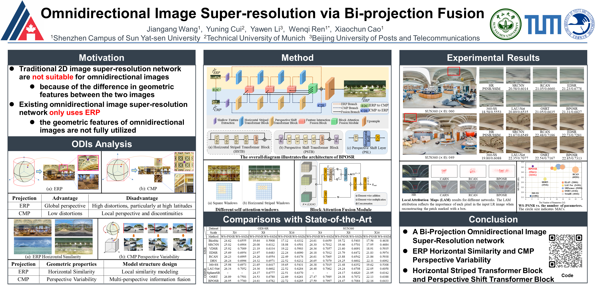

# Omnidirectional Image Super-resolution via Bi-projection Fusion (AAAI 2024)  [[PDF](https://ojs.aaai.org/index.php/AAAI/article/view/28354/28693)]

**Jiangang Wang | Yuning Cui | Yawen Li | Wenqi Ren | Xiaochun Cao**

> Shenzhen Campus of Sun Yat-sen University  
> Technical University of Munich  
> Beijing University of Posts and Telecommunications  

:star: If BPOSR is helpful to your images or projects, please consider starring this repo. Thank you! :hugs:

#### 🚩 Accepted by AAAI 2024

## 🔎 Poster


---

## ⚙️ Dependencies and Installation

To get started, follow these steps to clone the repository, set up your environment, and install the required dependencies:

```bash
## Clone this repository
git clone https://github.com/W-JG/BPOSR
cd BPOSR

## Create a conda environment
conda create -n BPOSR python=3.10
conda activate BPOSR

## Install dependencies
pip install -r requirements.txt
python setup.py develop
```

---

## 🗂️ Prepare Training and Testing Data

### Step 1: Download LAU Dataset
Download the LAU dataset from [this link](https://drive.google.com/drive/folders/1w7m1r-yCbbZ7_xMGzb6IBplPe4c89rH9) and place it in the `Dataset` directory.  
To extract the data, run:

```bash
unrar x lau_dataset.rar
```

### Step 2: Clean the Data
To clean the dataset, similar to [OSRT](https://github.com/Fanghua-Yu/OSRT/blob/master/odisr/utils/make_clean_lau_dataset.py), run the following command:

```bash
python Data_prepare/make_clean_lau_dataset.py
```

This will create a `lau_dataset_clean` folder inside the `Dataset` directory.

---

## 🚀 Quick Inference

### Step 1: Download Pretrained Models
Download the pretrained weights from [this link](https://drive.google.com/drive/folders/1Tj4d2oje6B1AT1Ty8G0mc1dJyxwMgrry?usp=sharing) and place them in the `BPOSR/experiments` folder.

### Step 2: Run the Testing Command
Use the following commands to test with different scales:

```bash
CUDA_VISIBLE_DEVICES=0 python basicsr/test.py -opt ./options/BPOSR_test/test_BPOSR_x4.yml
CUDA_VISIBLE_DEVICES=1 python basicsr/test.py -opt ./options/BPOSR_test/test_BPOSR_x8.yml
CUDA_VISIBLE_DEVICES=2 python basicsr/test.py -opt ./options/BPOSR_test/test_BPOSR_x16.yml
```

---

## 🌈 Training

#### Single GPU
For single-GPU training, run the following command:

```bash
PYTHONPATH="./:${PYTHONPATH}" CUDA_VISIBLE_DEVICES=0 python -W ignore basicsr/train.py -opt options/BPOSR_train/train_BPOSR_SW_SRx4.yml
```

#### Multi-GPU
For multi-GPU training, use the following command:

```bash
PYTHONPATH="./:${PYTHONPATH}" CUDA_VISIBLE_DEVICES=0,1,2,3 python -W ignore -m torch.distributed.launch --nproc_per_node=4 --master_port=4321 --use_env basicsr/train.py -opt options/BPOSR_train/train_BPOSR_SW_SRx4.yml --launcher pytorch
```

> **Note:** Be sure to modify the `train_BPOSR_SW_SRx4.yml` file and set `num_gpu: 4` accordingly.

---

## 📷 Presentation
For a quick understanding of the project, you can check out the [poster](presentation/poster-BPOSR-AAAI-2024.pdf) and presentation slides:

- [English](presentation/EN-BPOSR-AAAI-2024.pdf)  
- [Chinese](presentation/CN-BPOSR-AAAI-2024.pdf)

---


## ❤️ Acknowledgments
This project is built upon [BasicSR](https://github.com/XPixelGroup/BasicSR).  
The core code for BPOSR is located in the following files:

- `basicsr/archs/BPOSR_arch.py`
- `basicsr/metrics/odi_metric.py`
- `basicsr/data/OmniImage_dataset.py`
- `basicsr/data/Omni_transforms.py`

---


## 📧 Contact
For any questions, feel free to reach out to:  
**Email:** `wangjg33@mail2.sysu.edu.cn`

---

## 🎓 Citations
If this code is helpful for your research or projects, please consider citing our paper. Here's the BibTeX reference:

```
@inproceedings{wang2024omnidirectional,
  title={Omnidirectional Image Super-resolution via Bi-projection Fusion},
  author={Wang, Jiangang and Cui, Yuning and Li, Yawen and Ren, Wenqi and Cao, Xiaochun},
  booktitle={Proceedings of the AAAI Conference on Artificial Intelligence},
  volume={38},
  number={6},
  pages={5454--5462},
  year={2024}
}
```

---

## 🎫 License
This project is released under the [MIT License](LICENSE).

---

## Apology
We apologize for the delayed release of the code. After the paper was submitted, the authors changed affiliations, which made it challenging to access the original data. We appreciate your understanding.

---

<details>
<summary>Statistics</summary>


</details>

